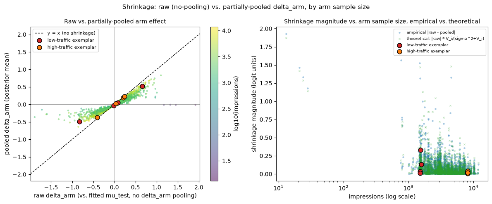

# clickworthy

Statistical analysis of the [Upworthy Research Archive](https://osf.io/jd64p/): 27,616 real headline A/B tests (128,217 headline/image "packages") run by Upworthy between January 2013 and April 2015, split by the archive's maintainers into an exploratory sample (4,873 tests) and a held-out confirmatory sample (22,743 tests). All results so far use the exploratory sample, which drops to 3,823 tests after the standard filters defined in `CLAUDE.md` (filter accounting in `01_data_ingestion.ipynb`).

## Findings so far

- **3,823 tests analyzed** (18,388 packages), after removing tests from a documented randomization-defect window (June 2013 – January 2014).
- **~83% relative lift:** the smallest effect the median test could reliably detect (80% power, alpha = 0.05, 1% baseline CTR, ~3,088 impressions per arm). 99.0% of tests could not reliably detect a lift below 50% relative.
- **44.4% → 34.1%:** share of tests where at least one package differed significantly from the others (chi-square across arms), before and after Benjamini–Hochberg correction across all 3,823 tests. Given the low power above, the non-significant tests are mostly not evidence of "no difference."
- **+14% winner's-curse inflation:** splitting each package's traffic into two random halves, the package picked as best on one half had a CTR 0.24 percentage points higher on that half than on the other (about 14% of its full-sample CTR of 1.73%), averaged across 3,822 tests. Picking the best-observed package and quoting its own CTR overstates it.
- **5.0% → 25.1% false positives:** in a simulated A/A test with no real difference, checking the p-value every 100 viewers per arm and stopping at the first p < 0.05 inflated the false-positive rate fivefold over a single look at the end.
- **Hierarchical model, full exploratory sample:** a PyMC binomial-logit model with package effects partially pooled across tests fit all 3,823 tests with zero divergences and max r_hat 1.003. On a stratified 500-test subsample (2,436 packages), each package's shrinkage toward the population matched a closed-form prediction based on its impressions and CTR at a correlation of 0.985.



*Each package's raw effect vs. its partially-pooled estimate (left) and the size of that shrinkage vs. impressions, observed and predicted (right), on the 500-test subsample: low-traffic packages are pulled hard toward zero, high-traffic ones barely move.*

The project walks through four things a product data scientist is expected to do well, in order of priority:

1. **Classical experiment analysis** — two-proportion tests, Wilson and Newcombe intervals, power/MDE, Benjamini–Hochberg across the archive, winner's curse, and a seeded A/A peeking simulation.
2. **Hierarchical Bayesian meta-analysis in PyMC** — a binomial-logit model with arm effects partially pooled across tests, non-centered parameterization, programmatic diagnostics, a shrinkage analysis on a stratified 500-test subsample, and the same model scaled to the full exploratory sample.
3. **Causal inference benchmarked against randomized ground truth** — construct a confounded observational dataset from the randomized tests, then see which observational estimators recover the known truth.
4. **Headline text mining** and a one-time confirmatory validation of the headline claims on the held-out sample.

`PLAN.md` is the staged roadmap with acceptance criteria per stage. `CLAUDE.md` records the repo's working conventions, the fixed statistical defaults every notebook follows, and a running log of pitfalls found along the way.

## Status

| Stage | Scope | Notebook | State |
|---|---|---|---|
| 0 | Ingestion, DuckDB layer, standard filters | `01_data_ingestion.ipynb` | Done |
| 1 | Classical A/B toolkit | `02_classical_ab.ipynb` | Done |
| 2 | Hierarchical Bayesian model, shrinkage, full-sample scaling | `03_hierarchical_bayes.ipynb` | Done through Task 4; mixture model (`04_mixture_effects.ipynb`) not started |
| 3 | Causal benchmark | `05_causal_benchmark.ipynb` | Not started |
| 4 | Text mining, decision framework, confirmatory validation | `06_results_summary.ipynb` | Not started |

Notebooks 04–06 are empty placeholders until their stage begins.

## Preregistration-style holdout

The confirmatory CSV is on disk but is deliberately never opened during development. All model building through Stage 3 uses the exploratory sample only. In Stage 4c, specific falsifiable claims are written down in `06_results_summary.ipynb` first, and only then is the confirmatory file read, exactly once, to check them. See the Data section of `CLAUDE.md` for the full rule.

## Repo layout

```
src/clickworthy/
  data_access.py   DuckDB layer: builds clickworthy.duckdb, standard filtered views
  classical.py     Stage 1: tests, CIs, power (thin wrappers over statsmodels/scipy)
  models.py        Stage 2: PyMC model builders
  causal.py        Stage 3: confounding construction + estimators (stub)
  evaluation.py    shared diagnostics checks (r_hat, ESS, divergences)
  constants.py     every fixed seed used anywhere in the project
notebooks/         numbered in dependency order; each imports from the package
                   and runs top-to-bottom from a fresh kernel
```

## Setup

Environment setup is manual, performed once before working in this repo or running any agentic tooling against it (see `CLAUDE.md` for why Miniforge/mamba is used instead of a plain `conda`):

```bash
brew install miniforge          # one-time, if not already installed
mamba shell init --shell zsh --root-prefix=/opt/homebrew/Caskroom/miniforge/base
# open a new terminal after this step
mamba create -n clickworthy -c conda-forge python=3.11 pandas duckdb statsmodels scipy pymc arviz scikit-learn matplotlib jupyter
mamba activate clickworthy
pip install -e . --no-deps
```

Activate with `mamba activate clickworthy` before working in this repo (including before launching Claude Code) — do not use `conda activate` for this project, see `CLAUDE.md`.

## Data

Download the two March 2020 package-level CSVs from the OSF project above and place them in `~/ml_datasets/clickworthy/` (not committed):

- `upworthy-archive-exploratory-packages-03.12.2020.csv` — used by everything through Stage 3
- `upworthy-archive-confirmatory-packages-03.12.2020.csv` — read only in Stage 4c

`01_data_ingestion.ipynb` builds `clickworthy.duckdb` from the exploratory file and verifies the documented row and test counts.

## Reproducing the fits

Every MCMC fit is saved to `idata/*.nc` immediately after sampling, and each fitting cell loads the cached file if it exists rather than resampling. The `idata/` directory is gitignored, so a fresh clone will re-run the fits on first execution; the full-exploratory-sample fit at the settled configuration (`tune=4000, target_accept=0.95, draws=4000`, 4 chains) is the expensive one. Once the cache exists, all three notebooks re-execute quickly.
